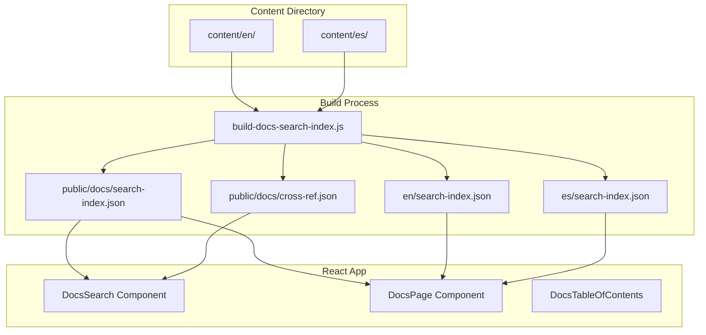

# OMZONE Docs i18n Implementation Plan

## Approach: Separate Content Directories per Language

### Directory Structure

```
src/docs/
├── content/
│   ├── en/                    # English content (primary)
│   │   ├── catalog/
│   │   │   ├── experiences.md
│   │   │   ├── editions.md
│   │   │   └── ...
│   │   ├── sales/
│   │   │   ├── orders.md
│   │   │   └── ...
│   │   └── ...
│   └── es/                    # Spanish content
│       ├── catalog/
│       │   ├── experiences.md
│       │   └── ...
│       ├── sales/
│       │   ├── orders.md
│       │   └── ...
│       └── ...
├── config/
│   └── navigation.js           # Language-aware navigation
└── components/                 # i18n-aware components
```

### Key Architecture Decisions

1. **URL Structure**: `/help/docs/[lang]/[slug]` (e.g., `/help/docs/en/experiences`)
   - Default language (en) can use `/help/docs/experiences` (no prefix)
   - Spanish uses `/help/docs/es/experiences`

2. **Language Detection**: 
   - URL prefix takes precedence
   - Fallback to browser language preference
   - Default to English if no match

3. **Search Indexing**:
   - Index both languages into unified search index
   - Store language metadata with each result
   - Search matches regardless of query language
   - Display results in current language

4. **Content Manifest**:
   - Separate manifest per language
   - Build script generates both from respective directories

---

## Implementation Phases

### Phase 1: Directory Restructure

1. Create `src/docs/content/es/` directory structure mirroring `en/`
2. Copy English files as starting point for Spanish translations
3. Rename existing `content/*.md` → `content/en/*.md`

### Phase 2: Content Manifest i18n Support

1. Modify `build-docs-search-index.js` to:
   - Process `content/en/` → generate `en/search-index.json`, `en/content-manifest.json`
   - Process `content/es/` → generate `es/search-index.json`, `es/content-manifest.json`
   - Generate merged cross-language search index

2. Search index structure:
   ```json
   {
     "slug": "experiences",
     "title": { "en": "Experiences", "es": "Experiencias" },
     "description": { "en": "...", "es": "..." },
     "keywords": { "en": [...], "es": [...] },
     "content": { "en": "...", "es": "..." },
     "headings": {
       "en": [...],
       "es": [...]
     }
   }
   ```

### Phase 3: Unified Cross-Language Search

1. Build unified search index that:
   - Indexes both English and Spanish content
   - Maps each search result to its translations
   - Allows search in either language
   - Displays results in current UI language

2. Search hook enhancement:
   - Load unified index on initialization
   - Search handles both languages
   - Results include translations for display

### Phase 4: Language Switching UI

1. Add language selector to DocsTopbar
2. URL reflects current language
3. Persist language preference in localStorage

### Phase 5: Component Updates

1. Update DocsPage to load content from correct language manifest
2. Update DocsSearch to use unified index
3. Update DocsSidebar to show translated page titles
4. Update DocsBreadcrumbs with translated section names

---

## Mermaid: Architecture Overview



---

## Search Index Structure

### Unified Index Format

```json
[
  {
    "slug": "experiences",
    "section": "catalog",
    "title": {
      "en": "Experiences",
      "es": "Experiencias"
    },
    "description": {
      "en": "Core wellness offerings",
      "es": "Ofertas de bienestar principales"
    },
    "keywords": {
      "en": ["experience", "session", "catalog"],
      "es": ["experiencia", "sesion", "catalogo"]
    },
    "content": {
      "en": "Full English content...",
      "es": "Contenido completo en español..."
    },
    "headings": {
      "en": [{"id": "overview", "text": "Overview", "level": 2}],
      "es": [{"id": "descripcion-general", "text": "Descripción General", "level": 2}]
    },
    "relatedRoutes": ["/admin/experiences", ...]
  }
]
```

---

## Files to Modify

| File | Changes |
|------|---------|
| `scripts/build-docs-search-index.js` | Process both en/ and es/ directories, generate unified index |
| `src/hooks/useDocsSearch.js` | Support cross-language search, unified index |
| `src/docs/components/DocsTopbar.jsx` | Add language selector |
| `src/docs/components/DocsPage.jsx` | Load content from correct language |
| `src/docs/components/DocsSearch.jsx` | Use unified index, show current language |
| `src/docs/components/DocsSidebar.jsx` | Show translated titles |
| `src/docs/components/DocsBreadcrumbs.jsx` | Use translated section names |
| `src/docs/config/navigation.js` | Support i18n page titles |
| `src/pages/help/HelpDocsPage.jsx` | Handle language prefix in URL |
| `src/docs/content/` | Restructure with en/ and es/ subdirs |

---

## Acceptance Criteria

1. [ ] All documentation pages have both English and Spanish versions
2. [ ] URL structure supports `/help/docs/[lang]/[slug]`
3. [ ] Search returns results regardless of query language (English or Spanish)
4. [ ] Search results display in current UI language
5. [ ] Language can be switched via UI selector
6. [ ] Language preference persists across sessions
7. [ ] Missing translations fall back to English gracefully